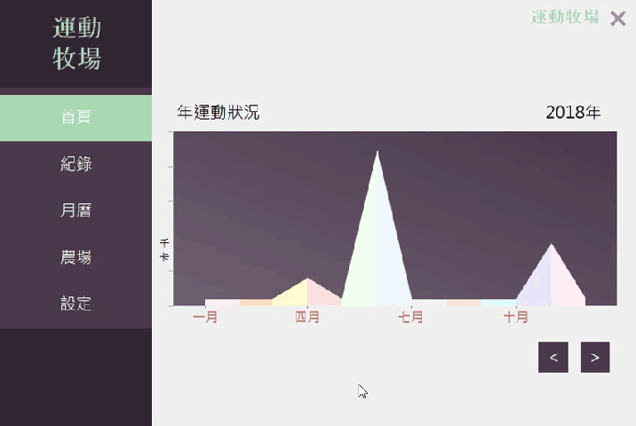
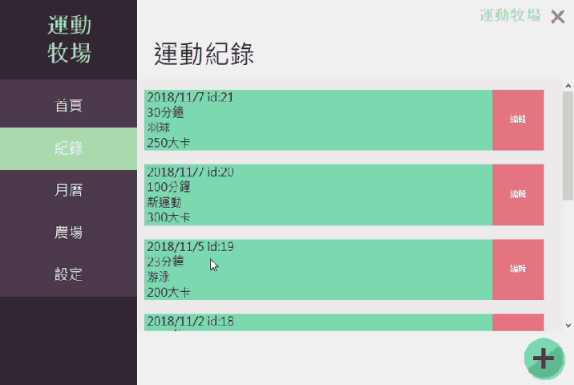
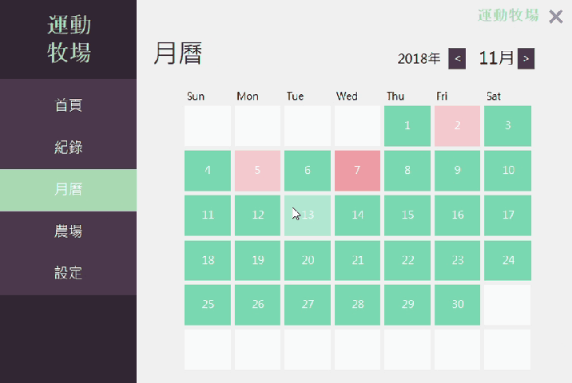
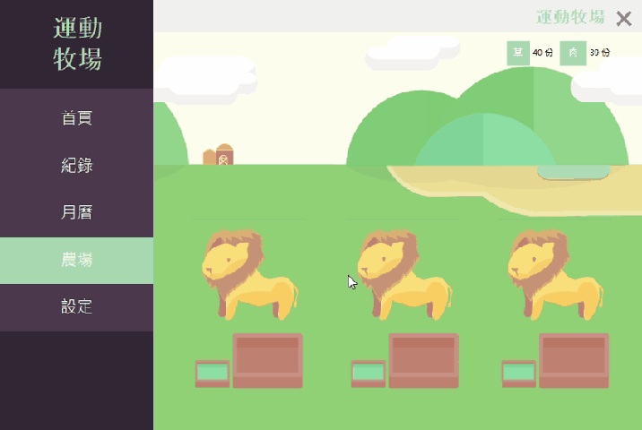

# 運動牧場 Sports Ranch

## 展示 DEMO
 
 

## 作者 Authors
|分工| 負責 |  工作描述 |
|:----:| -------------|--------------|
|前端程式設計| 洪曼容 (Klareh) | 介面設計、按鈕功能實現、功能設計 |
|後端程式設計| 陳楷雯  |資料庫上下載、字串處理、功能設計|

## 特點 Features
+ 將每一次的運動記錄起來
+ 使用者可以自訂運動類型
+ 透過月曆上每日不同的顏色深淺一目了然這個月的運動量
+ 一年內、一周間的卡路里表
+ 透過養成遊戲、為了餵食獅子更努力的運動吧!

## 技術/環境
+ 使用 Visual Studio 2015
+ 主要語言為 C#
+ 串接mySQL作為資料庫

## 優化UI
### 紀錄下載時機
+ 每一次只吃進幾筆資料
+ 減少使用者等待時間
+ 根據卷軸位置決定吃進資料的時機

### 在標籤中新增
當找不到想要的項目時可以直接新增
跳出新增頁面

